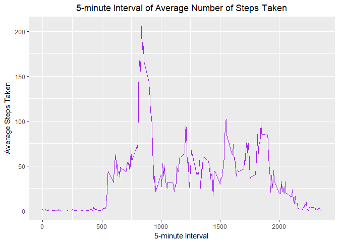

## Loading and preprocessing the data
### Answer:
Establish file connection of activity.csv in activity.zip 

```r
file_link <- unz("activity.zip","activity.csv")
```
Read file and save as "activity"

```r
activity <- read.csv(file_link,header = TRUE)
```
Transform date from factor to R date and update it

```r
activity$date <- as.Date(activity$date, format="%Y-%m-%d")
head(activity)
```

```
##   steps       date interval
## 1    NA 2012-10-01        0
## 2    NA 2012-10-01        5
## 3    NA 2012-10-01       10
## 4    NA 2012-10-01       15
## 5    NA 2012-10-01       20
## 6    NA 2012-10-01       25
```
***
## What is mean total number of steps taken per day?
### Answer:
Import library

```r
library(dplyr)
library(ggplot2)
```

1. Calculate the total number of steps taken per day

```r
totalStepsPerDay <- 
  activity %>%
  group_by(date) %>%
  summarise(totalsteps=sum(steps,na.rm = TRUE))
```

2. Make a histogram of the total number of steps taken each day, and save it into "actplot"

```r
actplot <-
  qplot(totalStepsPerDay$totalsteps,
      geom = "histogram",
      main = "Histogram of Total Steps Per Day",
      xlab = "Total Steps per Day",
      ylab = "Frequency",
      fill = I("#C6FF9A"),
      col = I("#AB47B3"),
      binwidth = 1200) +
  theme(plot.title = element_text(hjust = 0.5))
actplot
```

<!-- -->

3. Calculate and report the mean and median of the total number of steps taken per day

```r
finalmean <- mean(totalStepsPerDay$totalsteps)
finalmedian <- median(totalStepsPerDay$totalsteps)
```
The *mean* of the total number of steps taken per day is **9354.2295082** .  
The *median* of the total number of steps taken per day is **10395** .  

***
## What is the average daily activity pattern?
### Answer:

1. Make a time series plot (i.e. *type="l"*) of the 5-minute interval (x-axis)  
and the average number of steps taken, averaged across all days (y-axis)

Import library

```r
library(dplyr)
library(ggplot2)
```

Get average per interval across all days

```r
avgStepsPerInterval <- 
  activity %>%
  group_by(interval) %>%
  summarise(avgsteps=mean(steps,na.rm = TRUE))
```
Plot time series

```r
qplot(x = avgStepsPerInterval$interval, 
      y = avgStepsPerInterval$avgsteps,
      geom = "line",
      main = "5-minute Interval of Average Number of Steps Taken",
      xlab = "5-minute Interval",
      ylab = "Average Steps Taken",
      col= I("purple")) +
  theme(plot.title = element_text(hjust = 0.5))
```

<!-- -->

2. Which 5-minute interval, on average across all the days in the dataset, contains the maximum number of steps?

```r
maxSteps <- avgStepsPerInterval[which.max(avgStepsPerInterval$avgsteps),]
interval <- maxSteps[["interval"]]
steps <- maxSteps[["avgsteps"]]
```
The interval **835** has the maximum number of steps, which is **206.1698113** .

***
## Imputing missing values
### Answer:
1. Calculate and report the total number of missing values in the dataset  
(i.e. the total number of rows with *NAs*)

```r
totalNARows <- sum(!complete.cases(activity))
```
The total missing values in the dataset is **2304** .

2. Devise a strategy for filling in all of the missing values in the dataset.  
The strategy does not need to be sophisticated.  
For example, you could use the mean/median for that day, or the mean for that 5-minute interval, etc.

#### Exploration
**Plan1: Mean for Each Day**

```r
meanData1 <- 
  activity %>% 
  group_by(date) %>% 
  summarise(mean=mean(steps,na.rm = TRUE))
meanData1
```

```
## # A tibble: 61 x 2
##    date          mean
##    <date>       <dbl>
##  1 2012-10-01 NaN    
##  2 2012-10-02   0.438
##  3 2012-10-03  39.4  
##  4 2012-10-04  42.1  
##  5 2012-10-05  46.2  
##  6 2012-10-06  53.5  
##  7 2012-10-07  38.2  
##  8 2012-10-08 NaN    
##  9 2012-10-09  44.5  
## 10 2012-10-10  34.4  
## # ... with 51 more rows
```
**Plan2: Median for Each Day**

```r
medianData2 <- 
  activity %>% 
  group_by(date) %>% 
  summarise(median=median(steps,na.rm = TRUE))
medianData2
```

```
## # A tibble: 61 x 2
##    date       median
##    <date>      <dbl>
##  1 2012-10-01     NA
##  2 2012-10-02      0
##  3 2012-10-03      0
##  4 2012-10-04      0
##  5 2012-10-05      0
##  6 2012-10-06      0
##  7 2012-10-07      0
##  8 2012-10-08     NA
##  9 2012-10-09      0
## 10 2012-10-10      0
## # ... with 51 more rows
```
**Plan3: Mean for Each 5 Minute Interval**

```r
meanData3 <- 
  activity %>% 
  group_by(interval) %>% 
  summarise(mean=mean(steps,na.rm = TRUE))
meanData3
```

```
## # A tibble: 288 x 2
##    interval   mean
##       <int>  <dbl>
##  1        0 1.72  
##  2        5 0.340 
##  3       10 0.132 
##  4       15 0.151 
##  5       20 0.0755
##  6       25 2.09  
##  7       30 0.528 
##  8       35 0.868 
##  9       40 0     
## 10       45 1.47  
## # ... with 278 more rows
```
**Plan4: Median for Each 5 Minute Interval**

```r
medianData4 <- 
  activity %>% 
  group_by(interval) %>% 
  summarise(median=median(steps,na.rm = TRUE))
medianData4
```

```
## # A tibble: 288 x 2
##    interval median
##       <int>  <int>
##  1        0      0
##  2        5      0
##  3       10      0
##  4       15      0
##  5       20      0
##  6       25      0
##  7       30      0
##  8       35      0
##  9       40      0
## 10       45      0
## # ... with 278 more rows
```
After exploration of both Plan1 and Plan2 for each day, "NA"s still 
persist. Hence, both Plan1 and Plan2 are not good choices.

**Plan3 Plot: Mean for Each 5 Minute Interval**

```r
qplot(x = meanData3$interval,
      y = meanData3$mean,
      geom = "line")
```

<!-- -->

**Plan4 Plot: Median for Each 5 Minute Interval**

```r
qplot(x = medianData4$interval,
      y = medianData4$median,
      geom = "line")
```

<!-- -->

Comparing with both Plan3 and Plan4 plots, Plan3 plot looks more exciting. Hence, Plan3 is choosen for more sparks.

3. Create a new dataset that is equal to the original dataset but with the missing data filled in.
Fill in the "NA" with mean intervals and save as "activityfull"

```r
activityfull <-
  activity %>%
  group_by(interval) %>%
  mutate(steps = ifelse(is.na(steps),mean(steps,na.rm = TRUE),steps))
```

4. Make a histogram of the total number of steps taken each day and Calculate and report the mean and median total number of steps taken per day. 
Do these values differ from the estimates from the first part of the assignment?
What is the impact of imputing missing data on the estimates of the total daily number of steps?

Calculate the total number of steps taken per day

```r
totalStepsPerDayImpute <- 
  activityfull %>%
  group_by(date) %>%
  summarise(totalsteps=sum(steps,na.rm = TRUE))
```
Make a histogram of the total number of steps taken each day and save it as "actfullplot"

```r
actfullplot<-
  qplot(totalStepsPerDayImpute$totalsteps,
      geom = "histogram",
      main = "Histogram of Total Steps Per Day",
      xlab = "Total Steps per Day",
      ylab = "Frequency",
      fill = I("#C6FF9A"),
      col = I("#AB47B3"),
      binwidth = 1200) +
  theme(plot.title = element_text(hjust = 0.5))
actfullplot
```

<!-- -->

Calculate and report the mean and median of the total number of steps taken per day

```r
finalfullmean <- mean(totalStepsPerDayImpute$totalsteps)
finalfullmedian <- median(totalStepsPerDayImpute$totalsteps)
```
The *mean* of the total number of steps taken per day is **1.0766189\times 10^{4}** .  
The *median* of the total number of steps taken per day is **1.0766189\times 10^{4}** .  

*Before and After Impute Comparison*

*Impute*| *Mean* | *Median*
--|--|--
Before|9354.2295082|10395
After|1.0766189\times 10^{4}|1.0766189\times 10^{4}

From the table, we can see that imputing the 'NA's causes mean to increase and median to reduce.

*Total Steps Per Day Before Imput* 

```r
actplot
```

<!-- -->

*Total Steps Per Day After Imput* 

```r
actfullplot
```

<!-- -->

In the graph, it also shows the frequency of 0 steps for each day is drastically reduced and around 1100 steps is drastically increased.

## Are there differences in activity patterns between weekdays and weekends?

1. Create a new factor variable in the dataset with two levels - "weekday" and "weekend" indicating whether a given date is a weekday or weekend day.

Add a new column "day" and save as "activityNew"

```r
activityNew <- 
  activity %>%
  mutate(day = ifelse((weekdays(date) == "Saturday"|weekdays(date) == "Sunday"),"weekend","weekday"))
activityNew$day <- as.factor(activityNew$day)
head(activityNew)
```

```
##   steps       date interval     day
## 1    NA 2012-10-01        0 weekday
## 2    NA 2012-10-01        5 weekday
## 3    NA 2012-10-01       10 weekday
## 4    NA 2012-10-01       15 weekday
## 5    NA 2012-10-01       20 weekday
## 6    NA 2012-10-01       25 weekday
```

2. Make a panel plot containing a time series plot (i.e. *type="l"*) of the 5-minute interval (x-axis) and the average number of steps taken, averaged across all weekday days or weekend days (y-axis). See the README file in the GitHub repository to see an example of what this plot should look like using simulated data.
